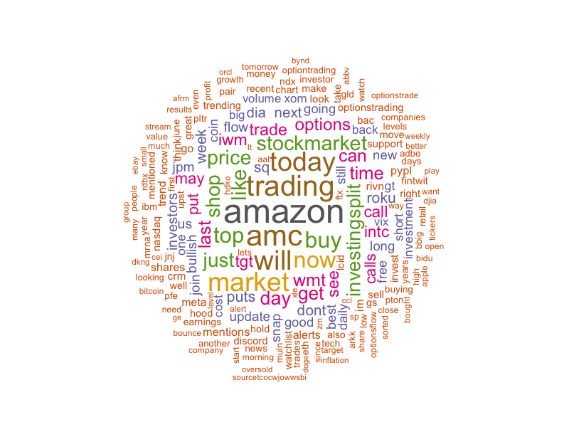

# Sentiment Analysis and Time Series Visualization

Welcome to the **Sentiment Analysis and Time Series Visualization** project. This project focuses on analyzing sentiment from tweets related to Amazon and visualizing these sentiments over time.

## Project Overview

### 1. Sentiment Analysis

Sentiment analysis is used to interpret and quantify the emotional tone or attitude expressed in text. This involves:

- **Data Collection:** Gathering tweets related to Amazon.
- **Text Processing:** Cleaning the text by removing punctuation, numbers, and irrelevant words.
- **Sentiment Analysis:** Calculating sentiment scores by date to explore trends in sentiment.

## Data Cleaning

Text cleaning, or text preprocessing, transforms raw text into a structured format suitable for analysis. Key steps include:

- **Removing Noise:** Eliminating irrelevant or inconsistent data.
- **Normalization:** Converting text to lowercase and stripping out unwanted characters.
- **Filtering Stopwords:** Removing common words (e.g., “and,” “the,” “is”) that do not contribute significant meaning.

Common stock ticker symbols were filtered out to focus on more relevant terms. This step ensures that the analysis captures meaningful insights.

## Sentiment Analysis

Sentiment analysis assesses the emotional tone of the text using the NRC Sentiment Lexicon. This lexicon categorizes words into eight emotions (anger, fear, anticipation, trust, surprise, sadness, joy, disgust) and two sentiments (negative, positive). 

- **N-Grams Analysis:** This involves examining sequences of words (unigrams, bigrams, trigrams) to uncover patterns and trends in the text.
  - **Unigrams:** Single words showing individual word frequencies.
  - **Bigrams:** Pairs of consecutive words revealing common two-word combinations.
  - **Trigrams:** Sequences of three consecutive words providing more context.

## Top Ten Words

The most frequent words in the tweet data are listed below. These words provide insight into common themes and topics discussed in the tweets:

1. **amazon** - 2760 occurrences
2. **amc** - 2360 occurrences
3. **trading** - 2282 occurrences
4. **will** - 2143 occurrences
5. **today** - 2086 occurrences
6. **market** - 2070 occurrences
7. **now** - 1742 occurrences
8. **buy** - 1714 occurrences
9. **top** - 1659 occurrences
10. **like** - 1545 occurrences

## Plots and Visualizations

### Sentiment Barchart

This plot shows the distribution of sentiments across the tweets, highlighting proportions of positive, negative, and neutral sentiments.


### Word Cloud

The word cloud visualizes the frequency of words in the tweet data. Larger words represent higher frequency or importance.



### Time Series Plot

This plot displays the trend of sentiment scores over time, helping to understand how sentiment varies across different periods.


## Conclusion

This project has successfully demonstrated how sentiment analysis can be applied to social media data to extract meaningful insights. By cleaning the text data and applying sentiment analysis techniques, we gained a better understanding of the emotional tone of tweets related to Amazon. The visualizations, including the sentiment barchart, word cloud, and time series plot, provide a comprehensive view of sentiment trends and key themes in the data. These insights can be valuable for monitoring public perception, identifying emerging trends, and making informed decisions based on social media sentiment.

## Setup Instructions

### Required Packages

Ensure you have the following R packages installed:

```r
install.packages(c('tidyverse', 'ggplot2', 'patchwork', 'syuzhet', 'wordcloud', 'tm', 'RColorBrewer', 'lubridate'))
